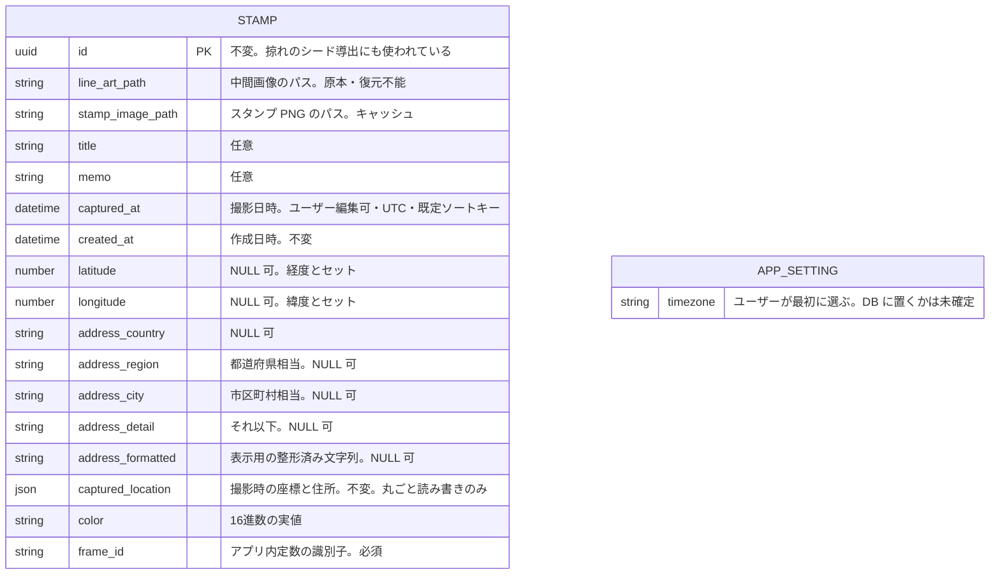
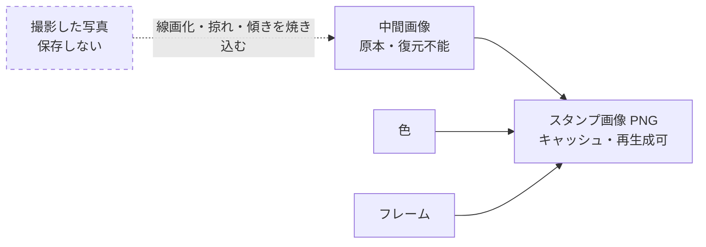
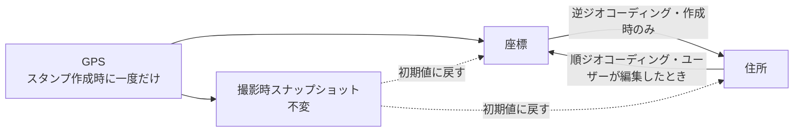

# スタンプのデータモデル

端末ローカル DB（`expo-sqlite`）へ移行するにあたっての、保存対象とその構造の設計。Refs #100, #98

## このドキュメントの位置づけ

DB 設計は「概念設計 → 論理設計 → 物理設計」の順に降りていく。**現時点で完了しているのは概念設計のみ**で、テーブル名・カラム名・型・制約はまだ決めていない。

| 手順 | 決めること | 状態 |
| --- | --- | --- |
| 1. 概念設計 | 何をエンティティとして切り出すか、エンティティ間の関係 | **完了**（このドキュメント） |
| 2. 要求の裏取り | 画面ごとの読み書きパターン、件数の見積もり | 未着手 |
| 3. 論理設計 | テーブル・カラム・主キー・制約 | 未着手 |
| 4. 物理設計 | 型・インデックス・マイグレーション機構 | 未着手 |

ここに書くのは**決定そのものよりも、その理由**である。理由が失われると、後から「不要に見えるカラム」を消したり、「安全に見える操作」で復元不能なデータを壊したりする。特に次の3つは、理由を知らないと必ず踏み抜く。

- なぜ撮影した元写真を保存しないのか
- なぜ一度リリースしたフレームを削除してはいけないのか
- なぜ撮影時の位置情報を別に保持するのか

---

## 結論: エンティティは「スタンプ」1つだけ

関連テーブルも中間テーブルも要らない。1対多になる箇所が1つも無いため。

- 元写真を保存しないので、写真エンティティが存在しない
- 中間画像とスタンプは1対1
- テキストは1スタンプに1つ。画像には焼き込まないので、位置やフォントなどの付随情報も持たない
- 住所は1スタンプに1つ
- 色は1スタンプに1つ

ただし、タイムゾーン設定だけはスタンプに属さない。これはアプリ全体の設定であり、置き場所は未確定（後述）。

### スタンプが持つ情報

| 分類 | 項目 | 性質 |
| --- | --- | --- |
| 識別 | ID | 不変。掠れ模様のシード導出にも使われている（後述） |
| 画像 | 中間画像のパス | **原本**。失うと復元不能 |
| 画像 | スタンプ画像（PNG）のパス | キャッシュ。中間画像＋色＋フレームから再生成できる |
| 内容 | タイトル | 任意。短い見出し。一覧表示用 |
| 内容 | テキスト | 任意。自由記述のメモ |
| 日時 | 撮影日時 | ユーザー編集可。一覧の既定ソートキー |
| 日時 | 作成日時 | 不変。システムが記録する |
| 位置 | 緯度・経度 | 自動取得＋編集可。NULL 可 |
| 位置 | 住所（構造化） | 国 / 都道府県相当 / 市区町村相当 / それ以下。NULL 可 |
| 位置 | 住所（表示用の整形済み文字列） | 同上 |
| 位置 | 撮影時スナップショット | 不変。「初期値に戻す」用 |
| 見た目 | 色 | 16進数の実値 |
| 見た目 | フレーム | 識別子。必須 |

### ER 図

**カラム名・型は仮称。**論理設計が未着手のため、ここでは構造を示すことだけが目的である。

**リレーションが1本も無いことがこの図の要点である。**スタンプ以外にエンティティが無く、1対多になる箇所も無い。`APP_SETTING` はスタンプと関係を持たず、そもそも DB に置くかどうかが未確定（後述）。

### 画像の派生関係

線が向いている方向が「何から何を作れるか」を表す。破線は保存しないもの。

中間画像へ向かう矢印が破線なのは、**元写真を保存しないためこの工程をやり直せない**ことを示す。逆に `png` へ向かう実線は、材料が全部残っているので何度でも作り直せることを示す。

### 位置情報の更新経路

座標と住所の間に矢印が両方向へ出ている点が重要で、**どちらか一方が原本という関係ではない**。GPS から自動で入るのは作成時の一度きりで、以降はユーザー操作でしか動かない。

---

## 画像 — 原本とキャッシュ

スタンプができるまでに画像は3枚登場する。**撮影した写真 → 中間画像 → スタンプ画像（PNG）**。このうち保存するのは後ろの2枚だけで、しかも立場が違う。

### 撮影した元写真は保存しない

加工が終わったあとの用途が「再生成」しかなく、それは中間画像があれば足りるため。端末の容量を無駄に食わない。

**帰結:** 中間画像より前の工程をやり直すことはできない。線画化の閾値調整やトリミングのやり直しは不可能で、中間画像がそこから先のすべての原本になる。

### 中間画像が唯一の原本

「線画加工まで済ませた画像」を指す。**掠れと傾きはこの画像に焼き込まれている。**

- 傾きはスタンプを押すときの振りかぶり方で決まる（`REQUIREMENTS.md` 2章）ため、押した瞬間にしか決まらない
- 焼き込むことで、色やフレームを変えても掠れ模様と傾きは動かない

**この画像を失うと、そのスタンプは復元できない。**元写真も残していないため、バックアップ・端末移行では必ず含める必要がある。

### スタンプ画像（PNG）はキャッシュ

「中間画像＋色＋フレーム」から常に同じ結果が再現できる派生物である。ランダム要素は中間画像側に焼き込み済みなので残っていない。

それでも PNG をファイルとして保存するのは、一覧表示のたびに合成し直すコストを避けるため。**消えても中間画像から作り直せるので、失われる情報は無い。**

| | 中間画像（原本） | スタンプ画像（キャッシュ） |
| --- | --- | --- |
| 消えたら | 復旧不能 | 作り直すだけ |
| バックアップ | 必ず含める | 含めなくてよい |
| 容量が逼迫したら | 消せない | 消してよい |

**不変条件: 色またはフレームを変更したら、必ず PNG を作り直す。**作り直しを忘れると、DB には新しい色が入っているのに画面には古い色のスタンプが出る。この更新は1箇所に集約する。

---

## 位置情報

### 座標

撮影時に端末から自動取得し、ユーザーが後から編集できる。取得できなければ NULL。

必須にしない理由は、位置情報の許可を与えていないユーザーや、GPS を掴めない場所（屋内・地下）を弾いてしまうため。

**帰結1:** 緯度と経度は必ず両方揃うか、両方とも無いかのどちらかしかない。片方だけ埋まる状態は存在しないので、論理設計で CHECK 制約として書く。

**帰結2:** 地図に出せないスタンプが存在する。地図系の処理はすべてこれを想定した作りにする。

### 住所

逆ジオコーディングで取得する（`expo-location` を想定。未確定）。取得には通信が要るため、圏外では NULL になる。

**構造化して複数カラムで持つ。**1本の文字列に連結しない。理由は3つ。

1. **分解のコストがゼロ。**逆ジオコーディングは最初から構造化されたオブジェクトを返すので、むしろ連結するほうが手間が増える
2. **潰すのは不可逆。**1本の文字列から都道府県を取り出すには文字列解析しかなく、海外の住所が混ざると破綻する。逆に、分けて持って後から連結するのは常に簡単。**この非対称が決め手**
3. **「訪れた都道府県を数える」は来る確率が高い。**構造さえ残っていれば後から無料で実装できる

加えて、**ジオコーディング API が返す整形済みの住所文字列も、そのまま別カラムに保存する。**自前で連結すると国ごとの語順の違い（日本は大きい単位から、英語圏は小さい単位から）を自分で面倒見ることになるため。表示にはこちらを使い、集計には構造化したカラムを使う。

なお、住所は別テーブルにしない。スタンプに1つしか付かないため、分けても JOIN が増えるだけで得るものがない。**テーブルを分ける判断基準は拡張性ではなく「1対多になるかどうか」**である。

### 座標と住所は双方向に更新し合う

どちらか一方が原本という関係ではない。

- **スタンプ作成時** — GPS で座標を取得し、そこから逆ジオコーディングで住所を引く（座標 → 住所）
- **ユーザーが位置を直すとき** — 住所を入力させ、そこから座標を引き直す（住所 → 座標）。住所から直すのが最も使いやすいという判断（未確定）

**住所から座標に変換できなかった場合は、住所だけを更新し座標は空にする。**座標を古い値のまま残すと、住所と地図上のピンが食い違う。空にすれば食い違いは起きず、代わりにそのスタンプは地図に出なくなる。

### 自動取得は作成時の一度きり

座標も住所もスタンプ作成時に一度だけ自動で入れ、**以降はユーザー操作でしか変わらない。**後から NULL の行を埋め直すような処理は持たない。

そのため「ユーザーが編集したか」を記録するフラグは不要である（自動取得がユーザーの手入力を上書きする経路が存在しないため）。

**帰結:** 圏外でスタンプを作ると、住所は永久に NULL のままになる。ユーザーが手で入力するしか埋まらない。座標さえ取れていれば地図には出るので実害は小さいが、**住所が空のスタンプが一定数できる前提で画面を作る**必要がある。

### 撮影時スナップショット

撮影時に取得できた座標と住所を、**書き換えない形で別に保持する。**ユーザーが編集をミスしたときに初期値へ戻せるようにするため。

元写真を捨てる判断と同じ構図である。**端末がその瞬間どこに居たかは、後から二度と取り直せない。**ユーザーの編集で上書きすると、観測された事実そのものが消える。

- 現在の座標・住所 = ユーザーの意思。編集で動く。表示・検索・地図はすべてこちらを見る
- 撮影時スナップショット = 機械が観測した事実。不変
- 「初期値に戻す」= スナップショットを現在の値へコピーするだけ。通信不要で必ず成功する

**スナップショットは1カラムにまとめて持つ。**構造化データを1カラムに押し込むのは通常避けるべきだが、ここでは許容する。検索や集計の対象にならず、使い道が「丸ごと読んで書き戻す」だけだからである。現在の住所を分解して持つのは集計のためだが、その理由がここには当てはまらない。

将来「撮影時の県で集計したい」が出てきたら、この判断は見直しになる。

### この仕組みは位置情報に限る

タイトル・テキスト・色・フレームには「初期値に戻す」を用意しない。**位置情報だけが二度と取り直せない観測値**であり、他はユーザーがいつでも入力し直せるため。

全項目を対象にするなら、スナップショットではなく編集履歴を別テーブルに積む汎用の仕組みが必要になり、規模が一段上がる。

---

## 日時

### 撮影日時と作成日時は別に持つ

**撮影日時はユーザーが編集できる。**そのため「いつこのデータができたか」を撮影日時で代用できない。作成日時を別に持つ。

現時点では撮影日時の初期値はアプリで撮影した時刻になる。将来カメラロールからの取り込みに広げる場合は、EXIF 由来の値も入りうる（現時点の仕様には無い）。

**更新日時は持たない。**

### 時刻まで保持する

日付だけだと、同じ日に複数スタンプを作ったときに並び順が決まらない。時刻まで持てば一意に並ぶ。表示の粒度（日付だけ見せる等）はフロント側で調整する。

一覧の既定ソートキーは撮影日時。編集で値が動くため、**並び順はユーザーの操作で後から入れ替わる。**

### タイムゾーンはユーザーが最初に選ぶ

アプリ全体の設定として1つ持つ。

**日時は UTC で保存し、表示時に選択されたタイムゾーンへ変換する。**ローカル時刻をそのまま保存すると、ユーザーが設定を変えた瞬間に過去のデータが全部ずれる。

---

## 見た目

### 色は16進数の実値で保存する

1スタンプに1色。現状はプリセットから選ばせるが、DB に入るのは選択肢の識別子ではなく実際の色の値。

- **将来カラーピッカーに移行してもスキーマが変わらない。**入り口が「選択肢」から「自由入力」に変わるだけで、書き込まれる値の形は同じ。これが最大の利得
- パレットの定義を後から変えても過去のスタンプの色は動かない。したがって**全スタンプの PNG 一斉再生成も発生しない**

保存形式の統一（`#` を含めるか、大文字小文字、桁数、透明度を含めるか）は論理設計で CHECK 制約として固める。

「朱色」のようなプリセット名を画面に出す必要が生じた場合は、16進数からは逆引きできないため、実値に加えて選んだ識別子も併せて持つ形になる。現時点では実値のみ。

### フレームは識別子で保存する

必須。デフォルトのフレームがあり、付かないことはない。後から変更できる。

色と違って実値を持てない（画像や SVG をスタンプごとに複製するのは無駄）ため、識別子の文字列だけを持つ。

**フレームの定義は DB に持たない。**マスタテーブルを作ると、アプリのアセットと DB の行という二重管理になる。端末ローカル DB はアプリのバージョンと独立に生き残るので、次の不整合が必ず起きる。

- アプリを更新してアセットを消したが、DB のマスタ行は残っている
- DB のマスタ行はあるが、アプリ側にアセットが無い

定義はアプリ内の定数として持ち、DB には選ばれた識別子だけを入れる。

### 一度リリースしたフレームは削除しない

フレームは今後増やす可能性も減らす可能性もある。識別子だけを持つ以上、**廃止されたフレームを参照する古いスタンプが必ず残る。**

**廃止するときは、新規選択の一覧から外すだけにする。アセットと定義自体は消さない。**

本当に消すと、そのスタンプは元の見た目を復元できない（中間画像は残っているので別のフレームで作り直すことはできるが、元の姿は失われる）。

さらに厄介なのは、**壊れ方が遅れて出る**ことである。PNG をキャッシュとして持っているため、廃止直後は既存の PNG がそのまま表示され、誰も気づかない。問題が表面化するのは、ユーザーがそのスタンプの色を変えて PNG を作り直そうとした瞬間である。

---

## 守るべき不変条件

論理設計・物理設計・実装のすべてで維持する。

1. 緯度と経度は、両方揃っているか両方とも無いかのどちらかしかない
2. 色またはフレームを変更したら、必ず PNG を作り直す
3. 撮影時スナップショットは書き換えない
4. 中間画像はバックアップ・端末移行の対象に必ず含める
5. 一度リリースしたフレームのアセットと定義は削除しない
6. 日時は UTC で保存する

---

## 未確定事項

| 項目 | 内容 |
| --- | --- |
| タイムゾーン設定の置き場所 | 単一の値なので AsyncStorage で十分に見えるが、DB に設定テーブルを作れば端末移行時に DB ファイル1つで完結する。他の設定が増えるかどうかで決まる |
| 撮影時のタイムゾーンをスタンプごとに記録するか | 記録すれば将来「現地時刻で表示する」に広げられる。記録しなければその道は閉じる。コストは文字列カラム1つ。座標と同じく**二度と取り直せない観測値**である |
| 掠れのシード列を持つか | #100 のコメント参照。掠れを中間画像に焼き込む前提では、画素そのものが記録なのでシード列は不要になる。#138（工程順の見直し）の結論と整合を取る必要がある |
| 逆ジオコーディングの実装 | `expo-location` を想定しているが未確定 |
| 位置の編集 UI を住所入力にするか | 最も使いやすいという判断だが未確定 |
| 住所の構造化カラムの粒度 | 国 / 都道府県相当 / 市区町村相当 / それ以下、という区切りでよいか。逆ジオコーディング API が実際に返すフィールドに合わせて確定させる |

## 次にやること

手順2「要求の裏取り」。画面ごとの読み書きパターンを書き出し、この構造で無理なく引けるかを確かめる。ここで初めて一覧の並び・地図の引き方・件数の見積もりに踏み込み、その結果がインデックス設計の根拠になる。
