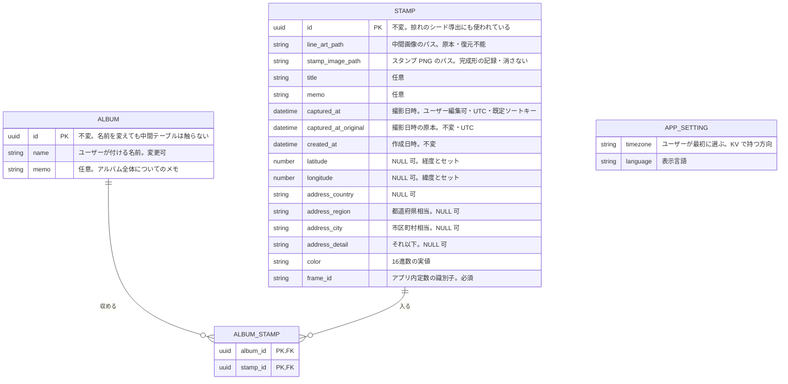
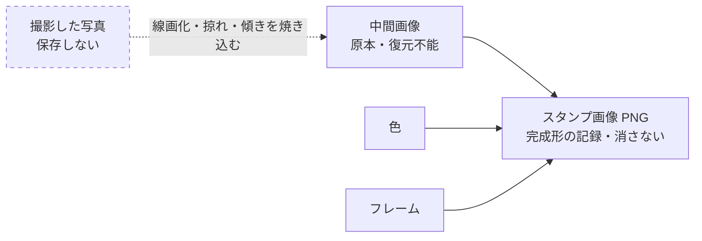
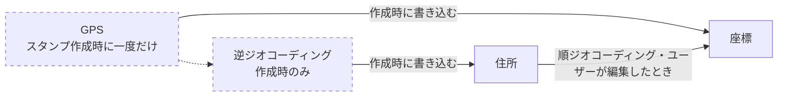

# スタンプのデータモデル

端末ローカル DB（`expo-sqlite`）へ移行するにあたっての、保存対象とその構造の設計。

## このドキュメントの位置づけ

DB 設計は「概念設計 → 論理設計 → 物理設計」の順に降りていく。

| 手順 | 決めること | 状態 |
| --- | --- | --- |
| 1. 概念設計 | 何をエンティティとして切り出すか、エンティティ間の関係 | **完了**（このドキュメント） |
| 2. 要求の裏取り | どの画面がデータに触るか、どう引くか | **完了**（「アクセス方法」） |
| 3. 論理設計 | テーブル・カラム・主キー・制約 | **`stamps` は完了**（#151）。アルバムの制約は v2 で決める |
| 4. 物理設計 | 型・インデックス・マイグレーション機構 | **`stamps` は完了**（#151。「v1 の物理設計」） |

**手順を飛ばして ER 図まで書いてある。**テーブル名・主キー・外部キーと、カラムの大半は ER 図で決まっている。ただし**すべてが確定したわけではない。**

カラムの構成そのものを左右する項目が3つあったが、**初回スキーマを確定させるために決着させた。**

| 項目 | 結論 |
| --- | --- |
| 撮影時のタイムゾーンをスタンプごとに記録するか | **記録しない。**表示はアプリ設定のタイムゾーンで行う。撮影地の現地時刻で表示する要求が出たときに、改めて列を足すか判断する |
| 掠れのシード列を持つか | **持たない。**`seedFromStampId()` がスタンプの id から導出しており、**id は不変なので再生成しても模様は変わらない。**列で持つ利点は「導出式を変えても既存の模様を守れる」ことだけで、現時点では必要ない |
| 住所の構造化カラムの粒度 | **国 / 都道府県相当 / 市区町村相当 / それ以下の4段で確定。**Google Geocoding も `expo-location` の `reverseGeocodeAsync` もこの4段に写せるため、**どちらの API を使うかはスキーマを変えない。**API の選定は実装時に実際の戻り値を見て決める |

そのうえで、制約が残っている。本文中に「論理設計で固める」と明記されているのは次の3つ。

- 緯度と経度が両方揃うか両方無いかを強制する CHECK
- 色の保存形式（`#` の有無・大文字小文字・桁数・透明度）の CHECK
- アルバム名の UNIQUE

加えて、**ER 図が表現していない制約も論理設計で決める。**

- **カラムごとの NULL 可否。**ER 図はコメントで「NULL 可」と書いたものだけを示しており、逆は明示していない。タイトル・メモ・座標・住所は NULL 可と決まっているが、失うと復元不能な `line_art_path` / `stamp_image_path` や、必須の `frame_id` に `NOT NULL` を付けるかは未決
- **外部キーの削除時の動作。**不変条件8（中間テーブルに、存在しないスタンプやアルバムを指す行を残さない）を `ON DELETE` で担保するか、アプリ側で担保するか
- **既定値**

ER 図の `uuid` / `datetime` / `json` は**SQLite に無い型**なので、実型への対応付けは物理設計で決める。

### v1 の物理設計

`stamps` については、上の未決を #151 で決着させた。SQL の実体は `frontend/src/db/migrations.ts` にあり、ここには理由だけを書く。

| 項目 | 結論 | なぜ |
| --- | --- | --- |
| マイグレーション機構 | `PRAGMA user_version` に適用済みの段数を持ち、起動時に `SQLiteProvider` の `onInit` で未適用の段を流す | Expo 公式の方式で、`expo-sqlite` 以外の依存が要らない。Expo Go で確実に動く |
| 型の強制 | `STRICT` テーブル | SQLite は既定だと列の型を無視して何でも入る。同梱の SQLite は 3.49 で、`STRICT`（3.37 以降）が使える |
| `uuid` | `TEXT`。長さ 36 を CHECK | |
| `datetime` | `TEXT`。`toISOString()` の形式（UTC・ミリ秒・末尾 `Z`）を GLOB で CHECK | 形式を固定すると文字列順が時刻順になる。オフセット付きを弾くので、不変条件6（UTC）を DB が保証する |
| 画像のパス | `documentDirectory` からの相対パス。絶対パス・URI を CHECK で弾く | iOS はアプリの更新でコンテナのパスが変わり、絶対パスだと更新後に画像を見失う |
| 色 | `#` 付き・大文字・6桁・透明度なし（`#DC321E`）を CHECK | |
| NOT NULL | 画像のパス2つ・日時3つ・色・`frame_id`・`scratch_level`・`tilt_angle` | いずれも無いとスタンプを描けないか、並べられない |
| `frame_id` の値 | 空文字だけ弾き、一覧では縛らない | フレームは増減し、廃止済みの識別子も残り続ける |
| 値の範囲 | 緯度 ±90・経度 ±180・`scratch_level` 0〜1・`tilt_angle` ±180 を CHECK | `stamp-press.tsx` がこの範囲に丸めている |
| 既定値 | 置かない | 値はすべてアプリが決める。既定値があると入れ忘れが黙って通る |
| 索引 | 主キー以外は置かない | 「日時の粒度」の方針どおり |

**制約は後から足せない**（「アルバムについて」を参照）ため、緩めるより締める側に倒した。緩める場合もテーブルの作り直しになる。

論理設計に踏み込んだあとで手順2 を埋めたため、順序は前後している。引き方と突き合わせた結果は「アクセス方法」にある。

ここに書くのは**決定そのものよりも、その理由**である。理由が失われると、後から「不要に見えるカラム」を消したり、「安全に見える操作」で復元不能なデータを壊したりする。特に次の2つは、理由を知らないと必ず踏み抜く。

- なぜ撮影した元写真を保存しないのか
- なぜスタンプ画像（PNG）をキャッシュとして扱ってはいけないのか

---

## エンティティ

スタンプとアルバムは多対多で、両者を中間テーブルでつなぐ

### スタンプ

- 元写真を保存しないので、写真エンティティが存在しない

#### スタンプが持つ情報

| 分類 | 項目 | 性質 |
| --- | --- | --- |
| 識別 | ID | 不変。掠れ模様のシード導出にも使われている（後述） |
| 画像 | 中間画像のパス | **原本**。失うと復元不能 |
| 画像 | スタンプ画像（PNG）のパス | 完成形の記録。フレーム廃止後は元の見た目を持つ唯一のもの |
| 内容 | タイトル | 任意|
| 内容 | メモ | 任意 |
| 日時 | 撮影日時 | ユーザー編集可。一覧の既定ソートキー |
| 日時 | 撮影日時の原本 | 不変。撮影した瞬間の時刻。「初期値に戻す」用 |
| 日時 | 作成日時 | 不変。システムが記録する |
| 位置 | 緯度・経度 | 自動取得＋編集可。NULL 可 |
| 位置 | 住所（構造化） | 国 / 都道府県相当 / 市区町村相当 / それ以下。NULL 可 |
| 見た目 | 色 | 16進数の実値 |
| 見た目 | フレーム | 識別子。必須 |

### アルバム

スタンプをまとめる入れ物
イメージ：iPhone の写真アプリのアルバムで、1枚のスタンプを複数のアルバムに入れられる

アルバムはスタンプとは独立して存在する
スタンプとアルバムは多対多になるため、中間テーブルでつなぐ

| 分類 | 必須か | 性質 |
| --- | --- | --- |
| ID | 必須 | アルバムを一意に定める。自動付与 |
| 名前 | 必須 | ユーザーが設定する |
| メモ | 任意 | アルバム全体についての自由記述（旅の感想など）。スタンプのメモとは別物で、1アルバムに1つしか付かないため、スタンプの住所と同じ理屈で別テーブルにせずカラムとして持つ |

今後の機能検討

- アルバム自体の属性（表紙にするスタンプ、アルバム一覧での並び順など）→ アルバムのテーブルに足す
- アルバムの中での属性（アルバム内でのスタンプの並び順など）→ 中間テーブルに足す。同じスタンプでもアルバムごとに位置が違うので、スタンプ側には持てない

### フレームとは逆に、アルバムは DB に持つ

フレームの定義は DB に持たない（前述）。一方、アルバムは DB に持つ。一見矛盾するが、データの持ち主が違う。

| | フレーム | アルバム |
| --- | --- | --- |
| 作るのは | 開発者 | ユーザー |
| 実体 | アプリのアセット | ユーザーデータ |
| 寿命 | アプリのバージョンに従う | DB に従う |
| 置き場所 | アプリ内の定数 | DB のテーブル |

フレームを DB に持つとアプリと DB の二重管理になるのと同じ理屈で、ユーザーが作ったアルバムをアプリ側に持つことはできない。**置き場所は、そのデータの寿命が何に従うかで決まる。**

---

### ER 図

`ALBUM_STAMP` は多対多を表すための中間テーブルで、現時点ではそれ自体は情報を持たない
`APP_SETTING` はスタンプと関係を持たず、テーブルではなく KV で持つ方向である（後述）。

### 画像の派生関係

線が向いている方向が「何から何を作れるか」を表す。破線は保存しないもの。
`png` へ向かう実線は、材料が揃っていれば作り直せることを示す。フレームを廃止すると `frame` の材料が失われるため、その後は `png` が元の見た目を持つ唯一のものになる。

### 位置情報の更新経路

GPS で取得した座標と、そこから逆ジオコーディングで引いた住所を、そのまま現在の座標・住所として書き込む。
撮影時の値を別に控えることはしない（「撮影時の位置情報は控えない」を参照）。

GPS から自動で入るのは作成時の一度きりで、以降の現在の座標・住所はユーザー操作でのみ変更される

---

## 画像

スタンプができるまでに画像は3枚登場する。撮影した写真 → 中間画像 → スタンプ画像（PNG）

### 保存するもの

- 中間画像
- スタンプ画像（PNG）

線画加工まで済ませた中間画像が原本となる。
掠れと傾きはこの画像に焼き込まれている。

- 傾きはスタンプを押すときの振りかぶり方で決まる（`REQUIREMENTS.md`）ため、押した瞬間にしか決まらない
- 焼き込むことで、色やフレームを変えても掠れ模様と傾きは動かない
- この画像を失うと、そのスタンプは復元できない。元写真も残していないため、バックアップ・端末移行では必ず含める必要がある。

スタンプ画像（PNG）は完成形の記録

「中間画像＋色＋フレーム」から作る派生物で、ランダム要素は中間画像側に焼き込み済みなので、材料が揃っていれば同じ結果を再現できる。

**それでもキャッシュとしては扱わない。**フレームは廃止することがあり（後述）、廃止するとアセットが消えて同じ結果を作り直せなくなる。そのとき元の見た目が残っているのは、フレームが焼き込まれた PNG だけになる。

一覧表示のたびに合成し直すコストを避ける役割も兼ねる。

| | 中間画像（原本） | スタンプ画像（完成形） |
| --- | --- | --- |
| 消えたら | 復旧不能 | 現行のフレームなら作り直せる。廃止済みのフレームなら元の見た目は復旧不能 |
| バックアップ | 必ず含める | 必ず含める |
| 容量が逼迫したら | 消せない | 消せない |

保存先は中間画像と同じく `documentDirectory` にする。`cacheDirectory` は OS の判断で消されうるため使わない。

不変条件: 色またはフレームを変更したら、必ず PNG を作り直す。

### v1 では中間画像を作らず、元写真を保存する

**上に書いた中間画像は、まだ作れない。**現行の `renderStampFromLineArt()`（`src/utils/skiaStamp.ts`）は
**着色 → 円マスク＋フレーム → 掠れ → 傾き**の順に処理しており、掠れと傾きが色・フレームより後段にある。
線画の段階に焼き込まれていないため、「掠れと傾きを焼き込んだ中間画像」は存在しない。

工程順の入れ替えは #138 で扱うが、**未解決の仕様判断が残っている。**掠れを前段へ移すと円の枠線に掠れが
乗らなくなり、スタンプの見た目が変わる。

そこで **v1 では中間画像を諦め、元写真を保存する。**保存する画像は次の2枚になる。

| | v1（当面） | 中間画像への移行後 |
| --- | --- | --- |
| 原本 | **元写真** | 中間画像 |
| 完成形 | スタンプ画像（PNG） | スタンプ画像（PNG） |
| デザイン変更 | 元写真から毎回フル生成 | 色とフレームだけ載せ替え |

元写真を端末へ保存する仕組みは `src/utils/originalPhotoStore.ts` として既に動いているので、これを使う。
デザイン変更が毎回フル生成になるのは現行と同じ挙動なので、**体験は悪化しない。**

**掠れは毎回作り直されるが、模様は変わらない。**`seedFromStampId()` がスタンプの id からシードを
導出しており、id は不変だからである。そのためシードを列で持つ必要はない。

#### v1 のカラムは ER 図と3点ずれる

ER 図は移行後の姿を描いている。中間画像に焼き込む前提が消えるぶん、v1 では次の差が出る。

| ER 図 | v1 | なぜ |
| --- | --- | --- |
| `line_art_path`（中間画像） | **元写真のパス** | 原本が入れ替わるため |
| — | **`scratch_level` を追加** | 押し込みの強さ。**無いと色を変えた瞬間に掠れが消える** |
| — | **`tilt_angle` を追加** | 振りかぶりの角度。**無いと傾きが消える** |

`scratch_level` と `tilt_angle` は**撮影時の DeviceMotion でしか決まらない値**で、導出も再取得も
できない。焼き込まない以上、再生成のたびに入力として必要になる。旧 backend の `stamps` テーブルにも
両方あった。中間画像へ移行すれば焼き込まれるので、そのとき不要になる。

掠れのシードだけは導出で足りるため、列を増やさない（前述）。

なお #138 が済んで中間画像へ移行したら、この節と「保存するもの」の関係は逆転する。そのときも
**元写真からの移行は無損失ではない**（中間画像を作り直せば掠れは同じだが、工程順が変わるぶん
枠線の見た目が変わる）ことに注意する。

### スタンプを削除したとき

「容量が逼迫しても消さない」のは、所有するスタンプが生きている間の話である。**スタンプを削除したら、中間画像とスタンプ画像（PNG）も消す。**DB の行だけを消すと、パスを知る者がいなくなった画像が `documentDirectory` に永久に残り、削除を繰り返すほど端末の容量を食う。

順序は **DB の行を先に消し、画像はその後に消す。**

- 逆順だと、画像を消した後に行の削除が失敗したとき、画像を失ったスタンプが一覧に残る。中間画像は復旧不能なので、この状態は取り返しがつかない
- 行を先に消せば、失敗しても残るのは誰も参照しないファイル（孤立ファイル）だけで、ユーザーから見た不整合は起きない

画像の削除に失敗した場合は、その場で再試行し、それでも消えなければ放置してよい。**アプリ起動時などに、どのスタンプの行からも参照されていない画像を掃除する処理を持つ。**削除時の再試行だけでは、途中でアプリが落ちた場合を拾えないため。

掃除では「参照されていない」ことを DB と突き合わせて確かめてから消す。作成途中（ファイルは書いたが行はまだ無い）の画像を誤って消さないよう、作成処理と同時に走らせないこと。

---

## 位置情報

### 座標

撮影時に端末から自動取得し、ユーザーが後から編集できる。取得できなければ NULL。

必須にしない理由：位置情報の許可を与えていないユーザーや、GPS を掴めない場所（屋内・地下）を弾いてしまうため

**帰結1:** 緯度と経度は必ず両方揃うか、両方とも無いかのどちらかしかない。片方だけ埋まる状態は存在しないので、論理設計で CHECK 制約として書く

**帰結2:** 地図に出せないスタンプが存在する。地図系の処理はすべてこれを想定した作りにする

### 住所

逆ジオコーディングで取得する。取得には通信が要るため（未確定）、圏外では NULL になる。

**構造化して複数カラムで持つ** 1本の文字列に連結しない。
逆ジオコーディングは最初から構造化されたオブジェクトを返す

1. 1本の文字列から都道府県を取り出すには文字列解析しかなく、海外の住所が混ざると破綻する。
2. **「訪れた都道府県を数える」機能への拡張性**

**表示用の住所は、構造化した4列をアプリ側でつないで作る。**ジオコーディング API が返す整形済みの文字列は保存しない。表示と集計が同じ列を見るので、両者が食い違うことがない。

当面は日本語の並び（大きい単位から）でつなぐ。英語圏のように小さい単位から並べる国の住所をどう出すかは、必要になった時点で表示側だけで対応できる。

なお、住所は別テーブルにしない。スタンプに1つしか付かないため

「〇〇温泉」のような場所の名前はタイトルに入れる

### 座標と住所は双方向に更新し合う

どちらか一方が原本という関係ではない。

- **スタンプ作成時** — GPS で座標を取得し、そこから逆ジオコーディングで住所を引く（座標 → 住所）。結果をそのまま現在の値として書き込む
- **ユーザーが位置を直すとき** — 住所を入力させ、そこから座標を引き直す（住所 → 座標）。住所から直すのが最も使いやすいという判断（未確定）

**住所から座標に変換できなかった場合は、住所も座標も空にする。**入力された文字列は保存しない。

- 座標を古い値のまま残すと、ユーザーが直そうとした位置と地図上のピンが食い違う
- 住所を古い値のまま残すと、ユーザーには編集が効かなかったように見える
- 入力された文字列だけを残す置き場所は無い。変換できなかった以上、4列に分解する手段が無く、表示用の文字列の列も持たない（「住所」を参照）

空にすれば食い違いは起きない。代わりにそのスタンプは場所なしになり、地図にも出なくなる。ユーザーには変換できなかったことを伝え、入力し直してもらう。

### 自動取得

作成時の一度きりとする。

座標も住所もスタンプ作成時に一度だけ自動で入れ、**以降はユーザー操作でしか変わらない。**
後から NULL の行を埋め直すような処理は持たない。

**帰結:** 圏外でスタンプを作ると、住所は永久に NULL のままになる。ユーザーが手で入力するしか埋まらない。座標さえ取れていれば地図には出るので実害は小さいが、**住所が空のスタンプが一定数できる前提で画面を作る**必要がある。

### 撮影時の位置情報は控えない

撮影時に取得した座標と住所を、編集用とは別に控えておく「撮影時スナップショット」は**持たない。**位置情報に「初期値に戻す」は用意しない（#151 で不要と判断した）。

**帰結:** ユーザーが位置を編集すると、撮影時の座標と住所は失われ、二度と取り直せない。

後から控えの列を足すことはできるが、足す前に作られたスタンプには控えが無いため、そのスタンプは戻せないままになる。「初期値に戻す」を後から求められたときは、この点を踏まえて判断する。

### 「初期値に戻す」は撮影日時に限る

タイトル・テキスト・色・フレーム・位置情報には「初期値に戻す」を用意しない。撮影日時の原本については「日時」の節で扱う。

## 日時

- 撮影日時の原本（`captured_at_original`）
- 撮影日時（`captured_at`）
- 作成日時（自動付与）

今後画像を読み込んでスタンプを作成する際に、「いつ作られたスタンプか」と「撮影日時」は別のデータとなるため

アプリで撮影した場合

- 撮影日時の初期値：アプリで撮影した時刻
- 作成日時の初期値：アプリで撮影した時刻

カメラロールから取り込み

- 撮影日時の初期値：写真のデータから取得
- 作成日時の初期値：アプリに取り込んだ時刻

### ユーザー編集用にカラムを持つ理由

ユーザーが編集をミスしたときに初期値へ戻せるようにするため。
「初期値に戻す」際は、原本を撮影日時へコピーする

### 日時の粒度

時刻まで保持する
日付だけだと、同じ日に複数スタンプを作ったときに並び順が決まらない。時刻まで持てば、自動記録された分には衝突が起きない。表示の粒度はFE側で調整する。

**ただし撮影日時だけでは一意にならない。**ユーザーが編集できるため、複数のスタンプに同じ値が入りうる。**現行のピッカーは日付単位でしか選べない**（`EditFieldSheet` が `mode: "date"` のみ。時刻まで選べるようにするのは #149）ので、同じ日に編集した行はまとめて同値になる。

そのため**並びは id を第2キーにして一意に定める**。id は主キーなので、カラムの追加は要らない。索引は現時点で主キー以外を置かない方針なので当面不要だが、将来一覧に索引を足すなら `(captured_at, id)` の複合索引が要るかを物理設計で判断する。`captured_at` 単独の索引では、同値行の並びを索引だけで決められないため。

一覧の既定ソートキーは撮影日時。編集で値が動くため、**並び順はユーザーの操作で後から入れ替わる。**

### タイムゾーン

アプリ初回起動時にユーザーが選択する
アプリ全体の設定のKVに持つ

**日時は UTC で保存し、表示時に選択されたタイムゾーンへ変換する。**ローカル時刻をそのまま保存すると、ユーザーが設定を変えた瞬間に過去のデータが全部ずれる。

## アプリ設定が持つもの

- タイムゾーン（前述）
- 表示言語

テーマの選択も将来追加する予定だが、今回のスコープには含めない。設定項目は今後も増える前提で置き場所を決める（未確定事項を参照）。

---

## スタンプの見た目に関するデータ

- 色
- フレーム

### 色

16進数の実値で保存する
1スタンプに1色。現状はプリセットから選ばせるが、DB に入るのは選択肢の識別子ではなく実際の色の値。
理由：カラーパレットから選択にした際にも対応できるようにするため

保存形式の統一（`#` を含めるか、大文字小文字、桁数、透明度を含めるか）は論理設計で CHECK 制約として固める。

「朱色」のようなプリセット名を画面に出す必要が生じた場合は、16進数からは逆引きできないため、実値に加えて選んだ識別子も併せて持つ形になる。現時点では実値のみ。

### フレーム

識別子で保存する
デフォルトのフレームがあり、付かないことはない。後から変更できる。
色と違って実値を持たないため、識別子の文字列だけを持つ。

### DB に持たない理由

マスタテーブルを作ると、アプリのアセットと DB の行という二重管理になる。端末ローカル DB はアプリのバージョンと独立に生き残るので、次の不整合が必ず起きる。

- アプリを更新してアセットを消したが、DB のマスタ行は残っている
- DB のマスタ行はあるが、アプリ側にアセットが無い

定義はアプリ内の定数として持ち、DB には選ばれた識別子だけを入れる。

### フレームの廃止

フレームは今後増やす可能性も減らす可能性もある。識別子だけを持つ以上、**廃止されたフレームを参照する古いスタンプが必ず残る。**

#### フレームを削除する際

フレームを削除するときはアセットと定義を削除する
消しても既に作成済みのスタンプの見た目は変更されない。
注意：廃止済みのフレームを参照するスタンプは、PNG を作り直した瞬間に元の見た目へ戻せなくなる。作り直すのは色またはフレームを編集したときだけなので、ユーザーが編集しない限り見た目は変わらない。

そのため次の2つを実装で守る。

- 作り直すときは、廃止済みの識別子をデフォルトのフレームに置き換える：置き換え先を決めておかないと、描画処理が存在しない識別子を受け取って失敗する
- 編集の前に警告を出す：「このフレームは提供を終了しました。編集すると別のフレームに変わり、元に戻せません」など

---

## データアクセス方法

地図については未定義

**この節が扱うのはスタンプのデータに限る。**アプリ設定（タイムゾーン・表示言語）はテーブルではなく KV で持つ方向で、どの画面でいつ読み書きするかの裏取りは未着手。設定画面（`app/mypage/language.tsx` ほか）は下の表に含めていない。

### どの画面で取得が必要か

| 画面 | 読む | 書く |
| --- | --- | --- |
| カメラ（撮影） | — | — |
| 写真調整 | — | — |
| スタンプを押す | — | 振り下ろしを検知した瞬間にスタンプ1件を作成。画面に入った時点では書かない |
| スタンプを押しました | 直前に作成した1件 | タイトル・メモ・住所をそれぞれ更新／「撮り直し」で削除 |
| アルバム一覧 | 全件 | — |
| スタンプ詳細 | id で1件 | タイトル・メモ・撮影日時・住所をそれぞれ更新／色・フレーム変更／削除 |
| マイページ | — | — |

**住所の更新は現行では保存されていない。**「スタンプを押しました」「スタンプ詳細」の両方に場所の編集 UI があるが、`updateStampDetails` に渡っているのはタイトル・メモ・撮影日時だけで、編集した住所は画面を離れると消える。ローカル実装で初めて満たすことになる。

住所を更新するときは、**座標も順ジオコーディングで引き直す**（「座標と住所は双方向に更新し合う」を参照）。変換できなければ住所も座標も空にする。

### 取得の種類

| 操作 | 引き方 | 呼ばれる頻度 |
| --- | --- | --- |
| 一覧取得 | 全件を撮影日時の降順、同値なら id の降順。使うのは **id**・画像のパス・撮影日時・タイトル。id は詳細画面へ渡すために要る | アルバムタブを開くたび＋引っ張って更新 |
| 1件取得 | id 指定 | 詳細画面を開くたび |
| スタンプ作成 | 行1件＋画像ファイル | スタンプを押すたび |
| 画像の作り直し | 色・フレームの変更に伴い、行の画像パス**と色・フレームの値**を更新 | デザイン変更のたび |
| スタンプ情報の更新 | タイトル / メモ / 撮影日時 / 住所を更新 | 編集のたび |
| 削除 | 行＋画像ファイル | 削除・撮り直しのたび |

### アルバムについて

`REQUIREMENTS.md` の主要機能に「コレクションの追加」「コレクションごとの表示」があるため、**アルバムは仕様上必要である。要件外ではない。**

そのうえで、**初回のマイグレーション（v1）では `ALBUM` / `ALBUM_STAMP` を作らない。**引き方を裏取りできないためで、理由は次の3つ。

- アルバム機能が未実装。フィルタの選択肢もマイページの「最近のコレクション」もハードコードで、**スタンプをコレクションに入れる UI に至っては存在しない**
- 未確定事項（並び順・表紙・名前の重複）が決まっていない。決めないまま `CREATE TABLE` すると、決まった時点で作り直しになる。SQLite の `ALTER TABLE` は列の追加と、3.35.0 以降なら条件付きで `DROP COLUMN` ができるが、**制約（`UNIQUE` / `CHECK` / `NOT NULL` / 外部キー）の追加・変更はできず、テーブルを作り直して移送するしかない**。アルバムの未確定事項はまさに `UNIQUE` と並び順のカラムなので、ここに当たる
- 逆に後から足すのは安い。行が1つも無いので移送するデータが無く、マイグレーションを1段増やすだけで済む

機能に着手する時点で、未確定事項を決めたうえで v2 として追加する。

### 一覧取得時の件数制限

現状は未決のため入れない。全件を取る。

**ただしこれは検証したうえでの判断ではない。**端末にスタンプが蓄積したときの一覧のロード時間とメモリ使用量を測っていないため、無制限取得のままでよいかは分からない。想定件数の見積もりとページングの閾値は、インデックスを決める物理設計と合わせて判断する（「未確定事項」に記載）。

---

## 守るべき不変条件

論理設計・物理設計・実装のすべてで維持する。

1. 緯度と経度は、両方揃っているか両方とも無いかのどちらかしかない
2. 色またはフレームを変更したら、必ず PNG を作り直す
3. （廃止）撮影時スナップショットは持たないことにした（#151）。番号は他の箇所から参照されているため詰めない
4. 中間画像とスタンプ画像（PNG）はバックアップ・端末移行の対象に必ず含め、容量が逼迫しても消さない
5. 廃止済みのフレームを参照するスタンプの PNG を作り直すときは、デフォルトのフレームに置き換え、事前にユーザーへ警告する
6. 日時は UTC で保存する
7. スタンプとアルバムの紐づけは ID で持ち、名前では持たない
8. 中間テーブルに、存在しないスタンプやアルバムを指す行を残さない
9. アルバムを削除しても、中のスタンプは削除しない
10. スタンプを削除したら、所有する中間画像とスタンプ画像（PNG）も削除する。DB の行を先に消し、画像の削除に失敗して残った孤立ファイルは後から掃除する

---

## 未確定事項

| 項目 | 内容 |
| --- | --- |
| アプリ設定の置き場所 | タイムゾーンと表示言語の2項目があり、将来テーマも加わる。スタンプと関係を持たず、クエリもしないので、テーブルではなく KV で持つ方向。項目が増えてもキーが増えるだけで、テーブルにする理由にはならない。端末移行を DB ファイル1つで済ませたい場合は、`expo-sqlite/kv-store`（AsyncStorage 互換の API で、実体は同じ SQLite ファイル）を使えば KV のまま両立できる。AsyncStorage と kv-store のどちらにするかは未確定 |
| 逆ジオコーディングの実装 | `expo-location` を想定しているが未確定 |
| 位置の編集 UI を住所入力にするか | 最も使いやすいという判断だが未確定 |
| アルバム名の重複を許すか | 一覧から選ぶ UI では、同名のアルバムが2つあると区別がつかない。UNIQUE 制約にする想定だが、大文字小文字・前後の空白の扱いと合わせて論理設計で確定させる |
| アルバム内のスタンプの並び | 現時点では撮影日時順を想定しており、中間テーブルに順序を持たせていない。iPhone のようにユーザーが手で並べ替えたいなら、中間テーブルに順序のカラムが要る |
| アルバム一覧の並び・表紙 | 現時点では持たない。必要になればアルバムのテーブルにカラムを足す |
| 想定件数とページングの閾値 | 現時点では一覧を全件取得し、件数制限を入れていない。端末に蓄積したときのロード時間とメモリを検証していないため、無制限のままでよいかは未検証。インデックスを決める物理設計と合わせて判断する。なお一覧の負荷は行データより画像のデコードに出るため、必要になるのはインデックスよりグリッドの仮想化の可能性が高い |
| アプリ設定の読み書き経路 | タイムゾーンと表示言語を、どの画面でいつ読み書きするかの裏取りが未着手。「データアクセス方法」はスタンプに限定している |
